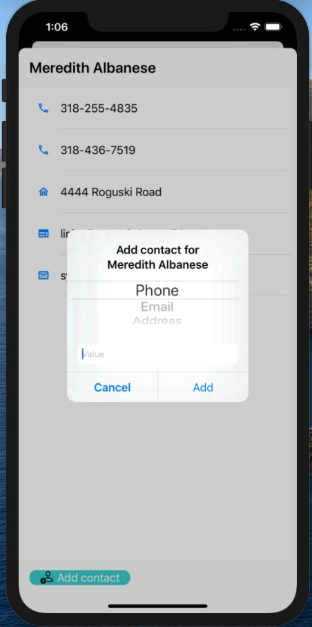

# Core data based contact app

Written in Swift.

Contains 3 entities.

Person +---0< Contact >0---+ ContactType

Features:
* Adding, editing, deleting persons
* Adding, editing, deleting contacts
* Contacts view for certain person
* Contacts view for certain contact type

iPhone 11 Pro Max - persons view | iPhone 11 Pro Max - adding a new person | iPhone 11 Pro Max - editing a person | iPhone 11 Pro Max - deleting a person
------------ | ------------- | ------------- | -------------
 |  |  | 

iPhone 11 Pro Max - one person contacts view  | iPhone 11 Pro Max - adding contact for a person 
------------ | -------------
 | 

iPhone 11 Pro Max - contact types view  | iPhone 11 Pro Max - contacts by contact type (phone) | iPhone 11 Pro Max -  adding contact for a contact type (phone)
------------ | ------------- | -------------
 |  | 

iPhone 11 Pro Max - contact types view in landscape  | iPhone 11 Pro Max - contacts by contact type (address) in landscape
------------ | -------------
 | 
